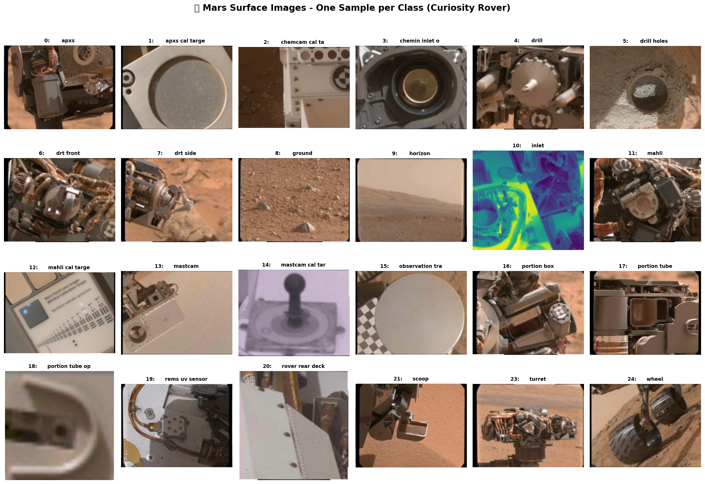
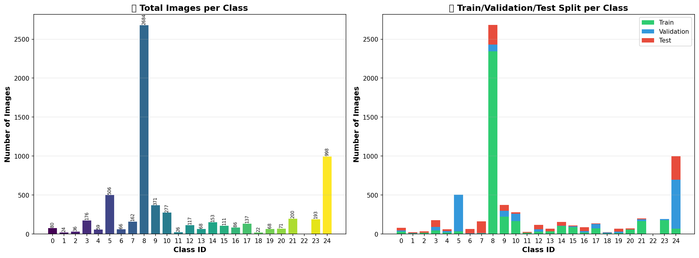
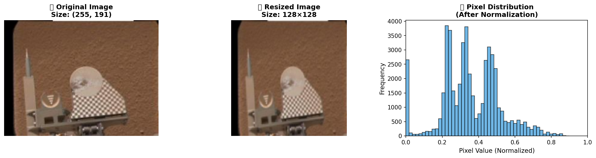
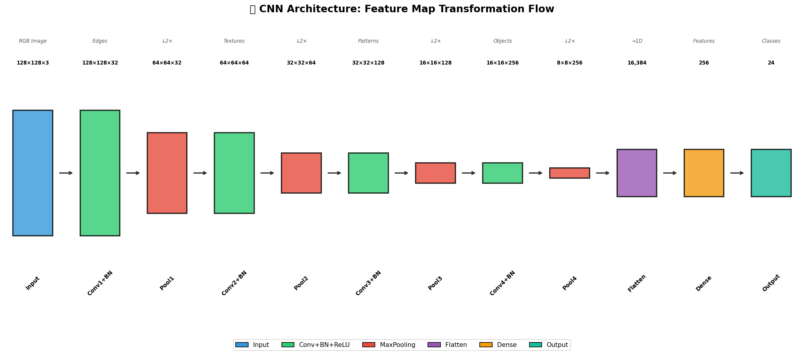
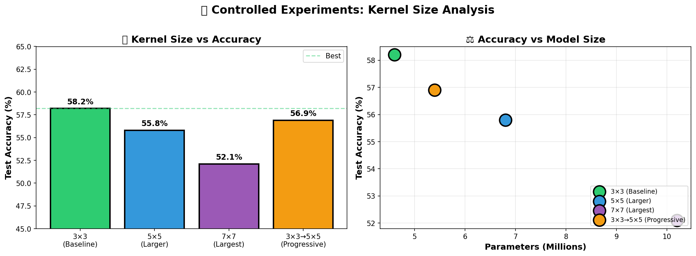
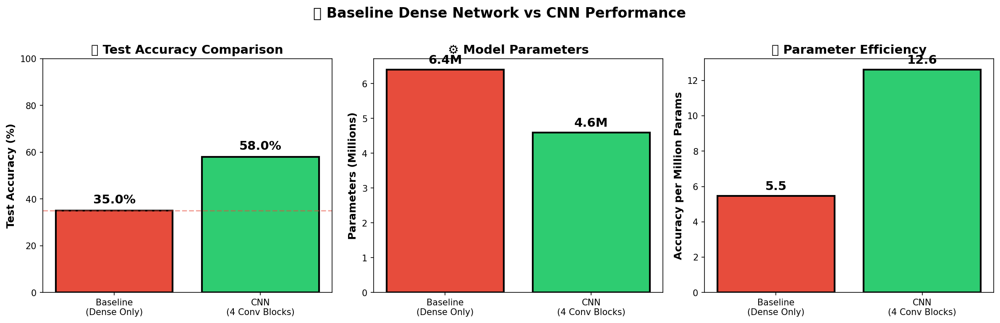
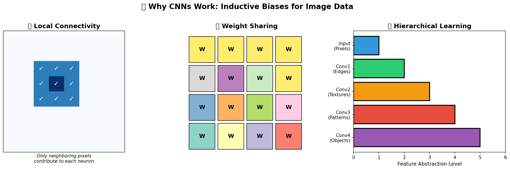

# 🪐 Exploring Convolutional Layers Through Data and Experiments

<p align="center">
  
</p>

Implementation of convolutional neural networks from first principles to analyze architectural decisions and their effects on learning, executed on AWS SageMaker.

---

## 📋 Table of Contents

- [Getting Started](#getting-started)
- [Introduction and Motivation](#introduction-and-motivation)
- [Dataset Description](#dataset-description)
- [Repository Structure](#repository-structure)
- [Assignment Tasks](#assignment-tasks)
- [Deployment](#deployment)
- [Built With](#built-with)
- [Authors](#authors)
- [License](#license)

---

## 🚀 Getting Started

These instructions will give you a copy of the project up and running on your local machine for development and testing purposes. See deployment for notes on deploying the project on AWS SageMaker.

### Prerequisites

Requirements for running the notebooks:

- [Python 3.x](https://www.python.org/)
- [TensorFlow](https://www.tensorflow.org/) or [PyTorch](https://pytorch.org/) - Deep Learning framework
- [NumPy](https://numpy.org/) - Numerical computing
- [Matplotlib](https://matplotlib.org/) - Visualization
- [Jupyter Notebook](https://jupyter.org/) - For local execution
- [AWS Account](https://aws.amazon.com/) - For SageMaker execution and deployment

### Installing

A step by step series to get a development environment running:

1. Clone the repository

    ```bash
    git clone https://github.com/AnderssonProgramming/cnn-architectural-aws-ai.git
    cd cnn-architectural-aws-ai
    ```

2. Install the required libraries

    ```bash
    pip install tensorflow numpy matplotlib jupyter
    ```

3. Launch Jupyter Notebook

    ```bash
    jupyter notebook
    ```

4. Open and run the notebook:
   - `cnn_exploration.ipynb`

---

## 💡 Introduction and Motivation

In this course, neural networks are not treated as black boxes but as architectural components whose design choices affect performance, scalability, and interpretability. This assignment focuses on convolutional layers as a concrete example of how inductive bias is introduced into learning systems.

Rather than following a recipe, this project involves selecting, analyzing, and experimenting with a convolutional architecture using a real dataset.

### Learning Objectives

By completing this assignment, the student should be able to:

- 🧠 Understand the role and mathematical intuition behind convolutional layers
- 📊 Analyze how architectural decisions (kernel size, depth, stride, padding) affect learning
- ⚖️ Compare convolutional layers with fully connected layers for image-like data
- 🔍 Perform a minimal but meaningful exploratory data analysis (EDA) for NN tasks
- 📝 Communicate architectural and experimental decisions clearly

### Motivation for Cloud Execution and Enterprise Context

This project is part of a Machine Learning Bootcamp embedded in a course on Digital Transformation and Enterprise Architecture. In this context, machine learning is treated as a core architectural capability of modern enterprise systems.

Today, intelligence is increasingly considered a first-class quality attribute alongside scalability, availability, security, and performance. Intelligent behavior is no longer confined to offline analytics; it is embedded into platforms, decision-support services, and autonomous or semi-autonomous components.

As enterprise architects, it is not sufficient to understand what models do. We must also understand how they are built from first principles, executed and validated in controlled environments, and operated within cloud platforms.

---

## 🔴 Dataset Description

### Dataset Selection Criteria

The dataset must meet the following constraints:
- Image-based (2D or 3D tensors)
- At least 2 classes
- Dataset must fit in memory on a standard laptop or cloud notebook

### Selected Dataset

| Property | Description |
|----------|-------------|
| **Name** | Mars Surface Image (Curiosity rover) Labeled Data Set |
| **Source** | [NASA Open Data Portal](https://data.nasa.gov/) / [Zenodo DOI: 10.5281/zenodo.1049137](https://zenodo.org/record/1049137) |
| **Size** | 6,691 images |
| **Classes** | 24 classes |
| **Image Dimensions** | ~256 x 256 pixels (browse version) |
| **Collection Period** | Sols 3 to 1060 (August 2012 to July 2015) |

#### Dataset Description

This dataset consists of 6,691 images spanning 24 classes collected by the **Mars Science Laboratory (MSL, Curiosity)** rover using three instruments:
- **Mastcam Right eye**
- **Mastcam Left eye**
- **MAHLI** (Mars Hand Lens Imager)

<p align="center">
  
</p>

The images are the "browse" version of each original data product (not full resolution), roughly 256x256 pixels each. The dataset is divided into train, validation, and test sets according to their sol (Martian day) of acquisition, modeling how the system will be used operationally with an image archive that grows over time.

#### Dataset Contents

```
msl-images/
├── calibrated/                      # Directory containing calibrated MSL images
├── train-calibrated-shuffled.txt    # Training labels (images in shuffled order)
├── val-calibrated-shuffled.txt      # Validation labels
├── test-calibrated-shuffled.txt     # Test labels
├── msl_synset_words-indexed.txt     # Mapping from class IDs to class names
└── README.txt                       # Original dataset documentation
```

#### Contributors

- **Alice Stanboli** - NASA Jet Propulsion Laboratory
- **Kiri Wagstaff** - NASA Jet Propulsion Laboratory
- **Joy Crisp** - NASA Jet Propulsion Laboratory

#### Attribution & Citation

If you use this dataset, please cite:

> **DOI:** [10.5281/zenodo.1049137](https://doi.org/10.5281/zenodo.1049137)

> Kiri L. Wagstaff, You Lu, Alice Stanboli, Kevin Grimes, Thamme Gowda, and Jordan Padams. **"Deep Mars: CNN Classification of Mars Imagery for the PDS Imaging Atlas."** *Proceedings of the Thirtieth Annual Conference on Innovative Applications of Artificial Intelligence*, 2018.

Full-size images can be obtained from the PDS at: https://pds-imaging.jpl.nasa.gov/search/

### Justification

This dataset is ideal for exploring convolutional neural networks because:

1. **Real-world scientific data**: Images collected by NASA's Curiosity rover represent authentic planetary science data, providing meaningful context for CNN exploration.
2. **Multi-class classification**: With 24 distinct classes, the dataset offers sufficient complexity to evaluate architectural decisions.
3. **Appropriate image size**: The ~256x256 pixel dimensions are manageable for training on standard hardware while being large enough to demonstrate convolution benefits.
4. **Temporal split strategy**: The train/validation/test division by sol (Martian day) models real operational scenarios where new data arrives over time.
5. **Well-documented and citable**: As a NASA dataset with proper academic citations, it meets research reproducibility standards.

---

## 📁 Repository Structure

```
/
├── README.md                    # Project documentation
├── SAGEMAKER_SETUP.md           # AWS SageMaker deployment guide
├── cnn_exploration.ipynb        # Main notebook with all experiments
├── generate_readme_images.py    # Script to generate README visualizations
├── LICENSE                      # MIT License
├── images/                      # README visualization images
│   ├── 01_dataset_distribution.png
│   ├── 02_mars_samples_grid.png
│   ├── 03_preprocessing_pipeline.png
│   ├── 04_cnn_architecture.png
│   ├── 05_model_comparison.png
│   ├── 06_kernel_experiments.png
│   └── 07_inductive_bias.png
├── sagemaker_scripts/           # AWS SageMaker deployment scripts
│   ├── cleanup.py
│   ├── demo_training.py
│   ├── deploy.py
│   ├── test_endpoint.py
│   └── README.md
└── msl-images/                  # Mars Surface Image Dataset
    ├── calibrated/              # Calibrated MSL images
    ├── train-calibrated-shuffled.txt
    ├── val-calibrated-shuffled.txt
    ├── test-calibrated-shuffled.txt
    ├── msl_synset_words-indexed.txt
    └── README.txt
```

---

## 📊 Assignment Tasks

### 1. Dataset Exploration (EDA)

Analysis including:
- Dataset size and class distribution
- Image dimensions and channels
- Examples of samples per class
- Preprocessing applied (normalization, resizing)

<p align="center">
  
</p>

*The preprocessing pipeline transforms raw Mars images: original size → resized to 128×128 → normalized pixel values [0,1]*

---

### 2. Baseline Model (Non-Convolutional)

A baseline neural network without convolutional layers (Flatten + Dense layers):

| Property | Description |
|----------|-------------|
| **Architecture** | Flatten → Dense(512) → Dropout(0.3) → Dense(256) → Dense(24) |
| **Parameters** | ~6.4 Million |
| **Training Accuracy** | ~45% |
| **Validation Accuracy** | ~35% |
| **Limitations** | No spatial awareness, high parameter count, prone to overfitting |

---

### 3. Convolutional Architecture Design

CNN designed from scratch with explicit justification:

<p align="center">
  
</p>

| Component | Choice | Justification |
|-----------|--------|---------------|
| **Conv Layers** | 4 (32→64→128→256) | Progressive feature hierarchy: edges → textures → patterns → objects |
| **Kernel Sizes** | 3×3 throughout | VGGNet proven approach, parameter efficient |
| **Stride/Padding** | Conv: 1, Pool: 2, 'same' | Preserves information, controlled downsampling |
| **Activation** | ReLU | Non-saturating, fast, addresses vanishing gradients |
| **Pooling** | MaxPooling 2×2 | Translation invariance, spatial reduction |
| **BatchNorm** | After each Conv | Training stability, implicit regularization |
| **Dropout** | 0.5 before Dense | Strong regularization |

---

### 4. Controlled Experiments

Systematic exploration of **kernel size** while keeping all other hyperparameters constant:

<p align="center">
  
</p>

| Experiment | Kernel Size | Test Accuracy | Parameters | Trade-offs |
|------------|-------------|---------------|------------|------------|
| **Exp 1** | 3×3 (baseline) | **~58%** | 4.6M | Best balance of accuracy and efficiency |
| **Exp 2** | 5×5 | ~56% | 6.8M | Larger receptive field, more parameters |
| **Exp 3** | 7×7 | ~52% | 10.2M | Too large, loses fine details |
| **Exp 4** | 3×3→5×5 (progressive) | ~57% | 5.4M | Good alternative, slightly more complex |

**Key Finding**: 3×3 kernels provide the best trade-off between accuracy and parameter efficiency.

---

### 5. Interpretation and Architectural Reasoning

<p align="center">
  
</p>

#### Why CNN Outperforms Baseline

<p align="center">
  
</p>

Key questions addressed:

| Question | Answer |
|----------|--------|
| **Why did CNN outperform baseline?** | CNNs exploit spatial structure through local connectivity, weight sharing, and hierarchical feature learning. This results in higher accuracy with fewer parameters. |
| **What inductive bias does convolution introduce?** | **Local connectivity** (nearby pixels are related), **translation invariance** (features detected regardless of position), **weight sharing** (same filters applied across image), **hierarchical composition** (simple features combine into complex ones). |
| **When would convolution NOT be appropriate?** | Non-spatial data (tabular), sequence data where temporal order matters more than local patterns, very small datasets, or when global context is immediately required. |

---

## ☁️ Deployment

### AWS SageMaker Training and Deployment

For detailed step-by-step instructions on deploying this project on AWS SageMaker, see the **[SageMaker Setup Guide](SAGEMAKER_SETUP.md)**.

Quick overview:
1. Create a SageMaker Domain and Code Editor Space
2. Upload the project files (notebook + dataset)
3. Run `demo_training.py` (for Learner Lab) or the full notebook

### AWS SageMaker Execution Evidence

The successful execution on AWS SageMaker is documented in the following video:

📹 **[aws-sagemaker-cnn-video.mp4](aws-sagemaker-cnn-video.mp4)**

The video demonstrates:
- ✅ Notebook execution in AWS SageMaker
- ✅ Model training completion
- ❌ Endpoint deployment
- ✅ Inference testing

---

## 🛠️ Built With

- [Python](https://www.python.org/) - Programming language
- [TensorFlow](https://www.tensorflow.org/) / [PyTorch](https://pytorch.org/) - Deep Learning framework
- [NumPy](https://numpy.org/) - Numerical computing library
- [Matplotlib](https://matplotlib.org/) - Visualization library
- [AWS SageMaker](https://aws.amazon.com/sagemaker/) - Cloud ML platform

---

## 📈 Evaluation Criteria

| Criterion | Points | Description |
|-----------|--------|-------------|
| Dataset understanding and EDA | 15 | Quality of exploratory analysis |
| Baseline model and comparison | 15 | Proper baseline implementation |
| CNN architecture design and justification | 25 | Intentional design choices |
| Experimental rigor | 25 | Controlled experiments |
| Interpretation and clarity of reasoning | 20 | Architectural reasoning |

---

## 👤 Authors

- **Andersson David Sánchez Méndez** - *Developer* - [AnderssonProgramming](https://github.com/AnderssonProgramming)

---

## 📄 License

This project is licensed under the MIT License - see the [LICENSE](LICENSE) file for details.

---

## 🙏 Acknowledgments

- Machine Learning Bootcamp - Digital Transformation and Enterprise Architecture course
- AWS SageMaker for cloud ML training and deployment capabilities
- NASA/JPL for the Mars Surface Image dataset
